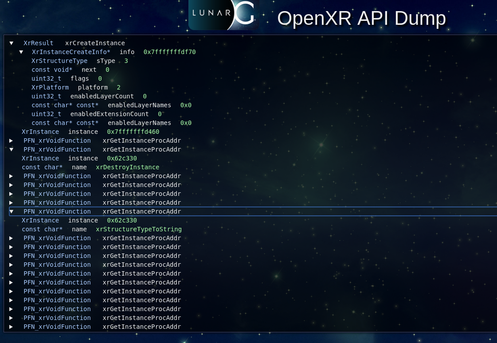

# The API Dump API Layer

## Layer Name

XR\_APILAYER\_LUNARG\_api\_dump

## Description

The API Dump layer records information about all OpenXR commands that it
encounters.  It only saves input information to each command, not the
results returned by lower API layers or the runtime.  This information can
then be written out to the prompt or a file.

## Settings

There are three modes currently supported:
1. Output text to stdout
2. Output text to a file
3. Output HTML content to a file

The default mode of the API Dump layer is outputting information to
stdout.  To enable text output to a file, two environmental variables
must be set:

* XR\_API\_DUMP\_EXPORT\_TYPE
* XR\_API\_DUMP\_FILE\_NAME

XR\_API\_DUMP\_EXPORT\_TYPE is used to define the type of output from API
dump.  Currently, this can only be set to the following options:

* text  : This will generate standard text output
* html  : This will generate HTML formatted content.

XR\_API\_DUMP\_FILE\_NAME is used to define the file name that is written
to.  If not defined, the information goes to stdout.  If defined,
then the file will be written with the output of the API dump layer.

## Example Output

### Example Text Output

For outputting text to a file, you would do the following:
```
export XR_API_DUMP_EXPORT_TYPE=text
export XR_API_DUMP_FILE_NAME=my_api_dump.txt
```

When the XR\_APILAYER\_LUNARG\_api\_dump API layer is enabled, the
output (whether to stdout or a file) should look like
the following:

```
XrResult xrCreateInstance
    XrInstanceCreateInfo* info = 0x7fff21511b90
    XrStructureType info->sType = 3
    const void* info->next = 0
    uint32_t info->flags = 0
    uint32_t info->enabledLayerCount = 0
    const char* const* info->enabledLayerNames = 0x0
    uint32_t info->enabledExtensionCount = 0
    const char* const* info->enabledLayerNames = 0x0
    XrInstance instance = 0x7fff21511080
XrResult xrGetInstanceProcAddr
    XrInstance instance = 0x155a230
    const char* name = xrCreateInstance
    PFN_xrVoidFunction* function = 0x7fff21512010
XrResult xrGetInstanceProcAddr
    XrInstance instance = 0x155a230
    const char* name = xrDestroyInstance
    PFN_xrVoidFunction* function = 0x7fff21512020
...
XrResult xrEnumerateSystems
    XrInstance instance = 0x155a230
    uint32_t systemPathCapacityInput = 0x1
    uint32_t* systemPathCountOutput = 0x0x7fff21511b84
    XrPath* systemPaths = 0x7fff21511b78
XrResult xrCreateSystem
    XrInstance instance = 0x155a230
    XrSystemCreateInfo* info = 0x7fff21511b30
    XrStructureType info->sType = 7
    uint32_t info->flags = 0x0
    XrPath info->physicalDisplayDevice = 0x0
    XrGraphicsAPI info->graphicsApi = 66565
    XrGraphicsBinding info->graphicsBinding
    XrGraphicsBindingOpenGL* info->graphicsBinding.openGL = 0x0
    XrGraphicsBindingOpenGLES* info->graphicsBinding.openGLES = 0x0
    XrGraphicsBindingVulkan* info->graphicsBinding.vulkan = 0x0
    XrGraphicsBindingD3D* info->graphicsBinding.d3d = 0x0
    XrGraphicsBindingMetal* info->graphicsBinding.metal = 0x0
    uint32_t info->enabledExtensionCount = 0x0
    XrSystem* system = 0x7fff21511b28
XrResult xrCreateFence
    XrSystem system = 0x155ca30
    XrFenceCreateInfo* info = 0x7fff21511610
    XrStructureType info->sType = 9
    XrFenceCreateFlags info->flags = 0
    XrFence* fence = 0x17017a0
```

You'll notice that the information contains:
* The parameter's type
* The parameter's name (expanded if it's inside a structure)
* The parameter's value

### Example HTML Output

For outputting HTML content to a file, you would do the following:
```
export XR_API_DUMP_EXPORT_TYPE=html
export XR_API_DUMP_FILE_NAME=my_api_dump.html
```

When the XR\_APILAYER\_LUNARG_api_dump APIlayer is enabled, and the
user has enabled HTML output, the resulting HTML file contents
(when rendered through an internet browser) should look like the
following:


