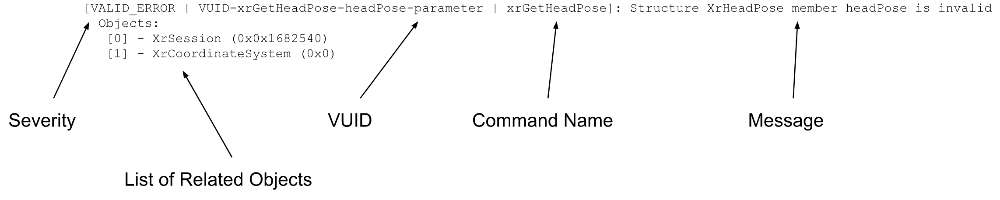
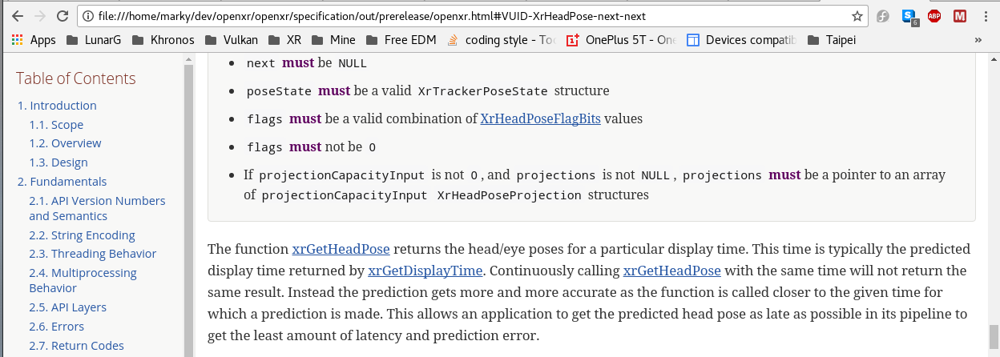
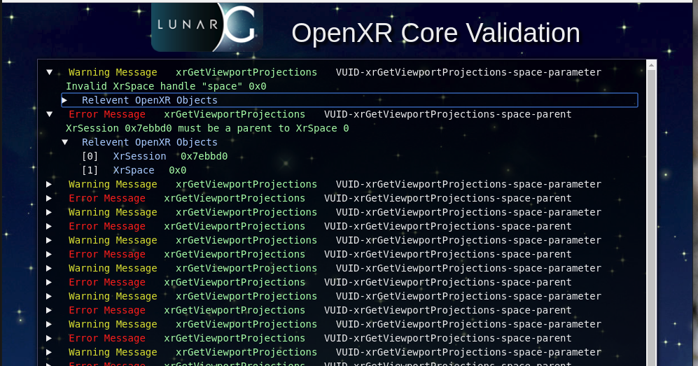

# The Core Validation API Layer

## Layer Name

XR\_APILAYER\_LUNARG\_core\_validation

## Description

The Core Validation API layer is responsible for verifying that an
application is properly using the OpenXR API.  It does this by
enforcing `Valid Usage` statements made in the OpenXR spec.

Developers should use this layer during application development to ensure
that they are properly using the OpenXR API.  This layer **should not be
enabled** in any released application, or performance will be negatively impacted.

## Settings

### Outputting to Text
There are three modes currently supported:
1. Output text to stdout
2. Output text to a file
3. Output HTML content to a file
4. Output to the application using the `XR_EXT_debug_utils` extension

Core Validation API layer does not output content by default.  In order to output
to either stdout or a file, you must use the following environmental variables:

* XR\_CORE\_VALIDATION\_EXPORT\_TYPE
* XR\_CORE\_VALIDATION\_FILE\_NAME

XR\_CORE\_VALIDATION\_EXPORT\_TYPE is used to define the type of output from
the API layer.  Currently, this can be set to the following:

* text  : This will generate standard text output.
* html  : This will generate HTML formatted content.

XR\_CORE\_VALIDATION\_FILE\_NAME is used to define the file name that is
written to.  If not defined, the information goes to stdout.  If defined,
then the file will be written with the output of the Core Validation API
layer.

### Outputting to XR\_EXT\_debug\_utils
If you desire to capture the output using the `XR_EXT_debug_utils` extension,
create a valid debug callback based on the definition of
`PFN_xrDebugUtilsMessengerCallbackEXT` and create an `XrDebugUtilsMessengerEXT`
object with the following:
- `XrDebugUtilsMessengerCreateInfoEXT`:`messageSeverities` set to accept
at least
`XR_DEBUG_UTILS_MESSAGE_SEVERITY_ERROR_BIT_EXT`, but preferably also
`XR_DEBUG_UTILS_MESSAGE_SEVERITY_WARNING_BIT_EXT`.
- `XrDebugUtilsMessengerCreateInfoEXT`:`messageTypes` set to accept at least
`XR_DEBUG_UTILS_MESSAGE_TYPE_VALIDATION_BIT_EXT`.

Also, you must create an instance with the `XR_APILAYER_LUNARG_core_validation`
layer enabled.
Once this is done, all validation messages will be sent to your debug callback.

For more info on the `XR_EXT_debug_utils` extension, refer to the OpenXR
specification.


## Example Output

### Example Text Output

By default, the core_validation API layer will output information
to stdout.  However, it supports two environmental variables:

```
export XR_CORE_VALIDATION_EXPORT_TYPE=text
export XR_CORE_VALIDATION_FILE_NAME=my_api_dump.txt
```
 
When the XR\_APILAYER\_LUNARG\_core\_validation layer is enabled, the
output (whether to stdout or a file) should look like the following:



You'll notice that the output is broken up into various sections:
1. The `severity` of message:
  * VALID_ERROR - The message indicates a validation error.
  * VALID_WARNING - The message indicates a validation warning.  This may
be valid behavior, but it may not.
  * VALID_INFO - The message indicates some potentially useful information
about validation.  Not an error or warning, but could be something of
interest.
<br/>
<br/>
2. The unique `Valid Usage ID [VUID]` for the Valid Usage statement that is of
interest to this message
  * You can jump to the section of the OpenXR specification that is associated
with this message by opening the HTML version of the spec, and appending
the hash-tag symbol (#) followed by the VUID.
     * For example, if you used the VUID `VUID-XrHeadPose-next-next`, you would
add "#VUID-XrHeadPose-next-next" to the end of the HTML link and get
something like  the following:
<br/>
<br/>

<br/>
<br/>
3. The name of `the OpenXR command` triggering this message
  * In this case, the error occurred internal to the `xrGetHeadPose` command
<br/>
<br/>
4. A short, but `descriptive message` of what likely caused issues.
<br/>
<br/>
5. A list of associated OpenXR `objects` to help identify the particular
case causing the failure.

### Example HTML Output

When the XR\_APILAYER\_LUNARG_core_validation APIlayer is enabled, and the
user has enabled HTML output, the resulting HTML file contents
(when rendered through an internet browser) should look like the
following:



